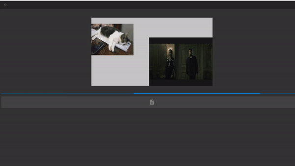

# VidComp

VidComp is a full featured video editor, powered by your browser

All processing by the editor occurs at the client

**Currently VidComp works best with Chrome be it mobile or desktop**

## Editing

## Rendering

## Documentation
<a href="https://www.youtube.com/watch?v=86hsgDPnjL8" target="_blank">Video of me talking about VidComp<a>

